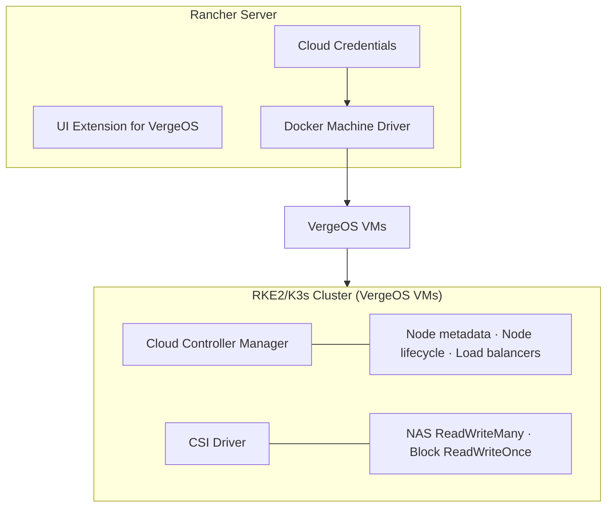

# Rancher Integration

## Overview

VergeOS integrates with [Rancher](https://www.rancher.com/){target="_blank"} through a Docker Machine node driver and a UI extension. Together, these components let us provision and manage RKE2/K3s clusters on VergeOS infrastructure directly from the Rancher interface.

| Component | Purpose |
|-----------|---------|
| [Docker Machine Driver](#docker-machine-driver) | Provisions VergeOS VMs as Kubernetes nodes |
| [UI Extension](#ui-extension) | Adds VergeOS cloud credential and machine config to Rancher |

Once clusters are running, the [Kubernetes Integration](kubernetes-integration.md) components (CSI Driver and Cloud Controller Manager) provide persistent storage and node lifecycle management — these work with any Kubernetes cluster on VergeOS, not just Rancher-provisioned ones.



### Prerequisites

- A VergeOS environment with API access
- A Rancher Server installation (v2.10+)
- A template VM running Ubuntu 24.04 with cloud-init installed
- A VergeOS API key (generated in User Settings)
- `kubectl` and `helm` CLI tools

---

## Docker Machine Driver

The Docker Machine driver is the foundation of the Rancher integration. It manages the full VM lifecycle through the VergeOS API — cloning template VMs, injecting SSH keys via cloud-init, and creating machines when clusters are provisioned. When a cluster is removed, the driver automatically deletes the VMs it created.

### How It Works

1. **Clones** the template VM with the requested machine name
2. **Configures** CPU cores, RAM, and cloud-init (SSH keys + hostname + optional user-data)
3. **Resizes** the primary disk if a custom size is specified
4. **Attaches** the VM to the specified network
5. **Powers on** and waits for an IP address (QEMU guest agent preferred, NIC DHCP fallback)

If any step fails, the driver cleans up the partially-created VM automatically.

### Template VM Preparation

Before provisioning clusters, we need a template VM in VergeOS with the following:

**Required:**

- **Ubuntu 24.04** (Noble Numbat) — the only supported template OS at this time
- **cloud-init** installed and enabled — the driver injects SSH keys and sets the hostname via a multi-part MIME cloud-init payload

**Recommended:**

- **QEMU guest agent** — enables accurate IP discovery; without it the driver falls back to NIC DHCP lease IPs

!!! tip "Ubuntu 24.04 Specifics"
    The driver automatically handles several Ubuntu 24.04 specifics via cloud-init:

    - **Netplan DHCP configuration** — writes a netplan config matching `en*` interfaces with `dhcp4: true`, handling PCI slot name changes across clones
    - **Machine-ID regeneration** — regenerates `/etc/machine-id` on each clone so that each VM gets a unique DHCP client identifier
    - **Cached DHCP lease cleanup** — removes stale DHCP leases inherited from the template

!!! warning "Memory Requirements"
    For Rancher use, allocate at least **4 GB RAM** per node (8 GB recommended). A single-node RKE2 cluster with Calico CNI will OOM with 2 GB.

Docker is **not** required on the template — Rancher installs its own container runtime (containerd) via the system agent. The template only needs cloud-init and the guest agent.

### Network Requirements

The VergeOS network specified in `--vergeos-network` must meet the following requirements for Rancher-provisioned clusters to function.

!!! warning "DHCP Required"
    The network must have DHCP enabled. The driver discovers node IPs via the QEMU guest agent, and cloned VMs will not receive addresses without DHCP.

!!! info "Rancher Connectivity"
    Nodes must be able to reach the Rancher server, and Rancher must be able to reach the nodes. Ensure the following ports are open between them:

    | Direction | Port | Protocol | Purpose |
    |-----------|------|----------|---------|
    | Node → Rancher | 443 | TCP | System agent registration and communication |
    | Rancher → Node | 9345 | TCP | RKE2 node registration |
    | Rancher → Node | 6443 | TCP | Kubernetes API server |
    | Node → Internet | 443 | TCP | Pull container images from registries |

    For the full port matrix including node-to-node requirements (which vary by CNI), see the [Rancher RKE2 port requirements](https://docs.rke2.io/install/requirements#networking){target="_blank"}.

### Installing in Rancher

The node driver and UI extension are packaged together in a single Helm chart. This installs the Docker Machine driver binary, registers the NodeDriver resource, and deploys the UI extension.

**Via Helm CLI:**

```bash
helm repo add verge-io https://verge-io.github.io/helm-charts
helm repo update

helm install vergeos-node-driver verge-io/vergeos-node-driver \
  -n cattle-system \
  --set "vergeosHosts={vergeos.example.com}"
```

The `vergeosHosts` value is a whitelist of VergeOS hostnames that Rancher's proxy is allowed to reach. Replace `vergeos.example.com` with the hostname(s) of the VergeOS environment(s).

**Via Rancher UI:**

1. Navigate to **Extensions** and click the **⋮** menu > **Manage Repositories**
2. Add a new repository with URL `https://verge-io.github.io/helm-charts`
3. Return to **Extensions** and install the **VergeOS Node Driver** extension

Once installed, **VergeOS** will appear as a node driver option when creating clusters.

!!! info "Self-Signed Certificates"
    If the VergeOS environment uses a self-signed certificate, set `insecure` to `true` when creating the cloud credential in Rancher. This tells the driver to skip TLS verification when communicating with the VergeOS API.

### Standalone Usage

The driver also works outside of Rancher with Docker Machine directly:

```bash
docker-machine create \
  --driver vergeos \
  --vergeos-host vergeos.example.com \
  --vergeos-api-key your-api-key \
  --vergeos-insecure \
  --vergeos-template-vm ubuntu-2404 \
  --vergeos-network your-network-name \
  --vergeos-ssh-user ubuntu \
  --vergeos-cpu-cores 2 \
  --vergeos-ram 4096 \
  --vergeos-disk-size 30 \
  my-docker-host
```

!!! note "Docker Required for Standalone Use"
    When used as a standalone Docker Machine driver (not through Rancher), the template VM also needs Docker installed, or we can use `--vergeos-cloudinit` to install it on first boot.

For the full list of driver flags and environment variables, see the driver repository in [Documentation and Resources](#documentation-and-resources) below.

!!! note "SSH User Default"
    The driver defaults to `root` for the SSH user, but the Rancher UI extension defaults to `ubuntu`. When using the CLI directly, set `--vergeos-ssh-user ubuntu` for Ubuntu templates.

---

## UI Extension

The UI extension adds VergeOS-specific components to the Rancher interface, providing a native experience when creating cloud credentials and configuring machines.

### What It Adds

**Cloud Credential Form** — prompts for:

- VergeOS host URL
- API key (stored as a Rancher secret)
- TLS verification toggle

**Machine Configuration Form** — provides:

- Template VM name (name of the VergeOS VM to clone)
- Network name (VergeOS VNet to attach to)
- CPU cores, RAM, and disk size inputs
- Cloud-init user-data field
- SSH user and port configuration

!!! info "Compatibility"
    The UI extension requires Rancher v2.10+ and the Rancher Extensions framework v3.x.

!!! note "Installation"
    The UI extension is installed automatically as part of the [combined Helm chart](#installing-in-rancher). There is no separate installation step.

---

## Summary

The Rancher integration consists of two components packaged in a single Helm chart:

- **Docker Machine Driver** — clones VergeOS template VMs and manages their lifecycle for cluster provisioning
- **UI Extension** — adds VergeOS cloud credential and machine configuration forms to the Rancher interface

Together, they let us provision RKE2/K3s clusters on VergeOS infrastructure directly from the Rancher UI. Once clusters are running, the [Kubernetes Integration](kubernetes-integration.md) components handle persistent storage and node lifecycle.

## Next Steps

- Prepare a template VM (Ubuntu 24.04 + cloud-init + QEMU guest agent) in VergeOS
- Install the [VergeOS Node Driver](#installing-in-rancher) Helm chart in the Rancher cluster
- Provision a downstream cluster using **VergeOS** as the node driver
- Install the [CSI Driver and Cloud Controller Manager](kubernetes-integration.md) on the downstream cluster for persistent storage and load balancers

## Documentation and Resources

For detailed configuration, driver flags, chart values, and release notes, see the GitHub repositories:

| Repository | Description |
|------------|-------------|
| [docker-machine-driver-vergeos](https://github.com/verge-io/docker-machine-driver-vergeos){target="_blank"} | Docker Machine / Rancher node driver |
| [ui-extension-vergeos](https://github.com/verge-io/ui-extension-vergeos){target="_blank"} | Rancher UI extension |
| [helm-charts](https://github.com/verge-io/helm-charts){target="_blank"} | Helm chart repository |

## Support

If you encounter issues or have feature requests, please open an issue on the relevant GitHub repository:

[https://github.com/verge-io/docker-machine-driver-vergeos/issues](https://github.com/verge-io/docker-machine-driver-vergeos/issues){target="_blank"}
