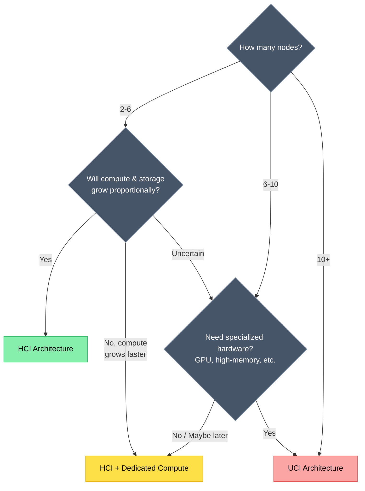

# VergeOS Architecture Guide

VergeOS offers three distinct architecture models, each optimized for different deployment scenarios, scale requirements, and operational preferences. This guide will help you understand each architecture and determine the best fit for your environment.

## What You'll Learn

- Architecture characteristics and design principles
- When to choose each architecture model
- Hardware requirements and specifications
- Scaling strategies and growth paths

## Choosing an Architecture

Use the following decision flowchart to identify the optimal architecture for your environment.

### Decision Guide Questions

**Question 1: How many nodes will your deployment have?**

- **2-6 nodes**: Proceed to Question 2
- **6-10 nodes**: Proceed to Question 3
- **10+ nodes**: UCI Architecture is recommended

**Question 2: Will compute and storage needs grow proportionally?**

- **Yes, proportional growth**: HCI Architecture
- **No, compute growing faster**: HCI + Dedicated Compute
- **Uncertain**: Proceed to Question 3

**Question 3: Do you need specialized hardware (GPU, high-memory, etc.)?**

- **Yes, specialized hardware needed**: UCI Architecture
- **No, standard hardware**: HCI + Dedicated Compute
- **Maybe in the future**: HCI + Dedicated Compute

## Architecture Comparison

### Quick Overview

| Factor | HCI | HCI + Dedicated Compute | UCI |
|--------|-----|-------------------------|-----|
| **Typical Node Count** | 2-6 nodes | 4-12 nodes | 8+ nodes |
| **Scaling Model** | Unified scaling | Independent compute | Fully independent |
| **Hardware Standardization** | Highly uniform | Some variation | Maximum flexibility |
| **Workload Isolation** | Shared resources | Compute separated | Full separation |
| **Performance Optimization** | Balanced | Good | Optimal |
| **Initial Investment** | Lower (2-3 nodes minimum) | Moderate (HCI + compute) | Higher (more nodes required) |
| **Specialized Hardware** | Not supported | Limited (compute only) | Full support |
| **Best For** | SMB, branch offices | Growing enterprises | Large scale, specialized workloads |

### Architecture Strengths

=== "HCI"

    **Hyperconverged Infrastructure**

    - Simplest to deploy and manage
    - Lowest initial investment (2-3 nodes)
    - Predictable, proportional scaling
    - Ideal for edge/branch deployments

=== "HCI + Compute"

    **HCI + Dedicated Compute**

    - Maintains HCI simplicity with flexibility
    - Independent compute scaling
    - Cost-effective growth path
    - Bridge to UCI if needed

=== "UCI"

    **Ultra Converged Infrastructure**

    - Maximum performance optimization
    - Unlimited independent scaling
    - Specialized hardware support (GPU, etc.)
    - Purpose-built node optimization

## Detailed Comparison

### Technical Characteristics

| Characteristic | HCI | HCI + Compute | UCI |
|----------------|-----|---------------|-----|
| Compute Performance | Shared resources, balanced | Dedicated compute nodes improve VM density | Compute isolated from storage overhead |
| Storage Performance | Local storage, good latency | Network-attached for compute nodes | Purpose-built storage nodes, optimal IOPS |
| Network Requirements | Standard inter-node connectivity | Higher bandwidth for compute-storage traffic | Higher bandwidth for inter-cluster traffic |
| Resource Contention | Compute and storage share resources | Reduced on HCI, isolated on compute | Eliminated through full separation |
| Workload Isolation | Workloads share node resources | Compute workloads isolated | All functions fully isolated |
| Failure Domain | Node failure affects compute and storage | Varies by node type | Limited to specific cluster type |

### Scaling Patterns

**HCI Scaling**

- **Pattern**: Add identical nodes (compute + storage together)
- **Consideration**: Each node adds both compute and storage capacity
- **Best For**: Workloads with proportional compute and storage growth

**HCI + Compute Scaling**

- **Pattern**: Add compute nodes independently of storage
- **Consideration**: Compute scales independently while storage remains on HCI cluster
- **Best For**: Compute-heavy growth with stable storage needs

**UCI Scaling**

- **Pattern**: Independent scaling of controllers, storage, and compute
- **Consideration**: Each cluster type scales based on specific resource demands
- **Best For**: Environments requiring specialized hardware or maximum workload isolation

### Operational Considerations

| Aspect | HCI | HCI + Compute | UCI |
|--------|-----|---------------|-----|
| Initial Design | Straightforward | Moderate planning | More design decisions |
| Capacity Planning | Unified growth | Two resource pools | Independent resource pools |
| Workload Isolation | Shared resources | Compute isolated from storage | Full isolation between functions |
| Management Interface | Single cluster | Two clusters in same UI | Multiple clusters in same UI |
| Resource Contention | Possible | Reduced | Eliminated |

### Use Case Fit Matrix

| Use Case | HCI | HCI + Compute | UCI |
|----------|-----|---------------|-----|
| SMB Office Infrastructure (file services, print, email, AD) | **Ideal** | Suitable | Suitable |
| Branch/Remote Office Deployment (edge locations) | **Ideal** | Suitable | Suitable |
| VDI Deployment (small-medium scale, up to 250 desktops) | **Ideal** | **Ideal** | Suitable |
| VDI Deployment (large scale, 500+ persistent/non-persistent desktops) | Suitable | **Ideal** | **Ideal** |
| Development/Test Environment (CI/CD, staging) | **Ideal** | Suitable | Suitable |
| Web Hosting/Production Applications (containerized, microservices) | Suitable | **Ideal** | **Ideal** |
| Database Servers (OLTP, transactional workloads) | Suitable | **Ideal** | **Ideal** |
| AI/ML Workloads (GPU acceleration, model training) | Not Supported | Limited | **Ideal** |
| Service Provider/Multi-Tenant Hosting (MSP, cloud provider) | Suitable | Suitable | **Ideal** |
| Disaster Recovery Site (secondary site, replication target) | **Ideal** | **Ideal** | **Ideal** |
| High-Performance Computing (HPC clusters, batch processing) | Suitable | Suitable | **Ideal** |

## Decision Framework

### Choose HCI If:

- You want unified, proportional scaling of compute and storage
- Standardized hardware simplifies procurement and operations
- This is a branch/remote office or edge deployment
- You prefer the simplest initial deployment
- Your workloads don't require specialized hardware (GPU, etc.)

### Choose HCI + Dedicated Compute If:

- Compute needs are growing faster than storage needs
- You want to scale compute independently without adding storage
- You're running VDI or compute-intensive applications
- You want flexibility to add specialized compute later
- Cost optimization through targeted resource scaling is important

### Choose UCI If:

- You want maximum workload isolation from storage and control functions
- You require specialized hardware (GPU, high-memory nodes, etc.)
- Independent scaling of storage and compute is important
- You're a service provider or running multi-tenant workloads
- You want purpose-built clusters optimized for specific functions

## Next Steps

Explore detailed documentation for your chosen architecture:

- [HCI Architecture](hci.md) - Hyperconverged Infrastructure details
- [HCI + Dedicated Compute](hci-compute.md) - Hybrid architecture with independent compute scaling
- [UCI Architecture](uci.md) - Ultra Converged Infrastructure for maximum flexibility
