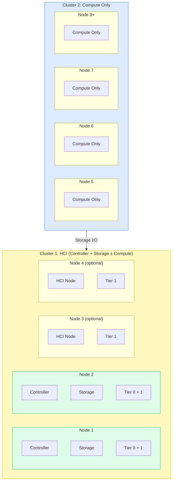

# HCI + Dedicated Compute Architecture

HCI Plus Dedicated Compute architecture extends the simplicity of HCI deployments by adding dedicated compute-only clusters for workload growth. This two-cluster design maintains your foundational HCI cluster (controller, storage, and optionally compute) while enabling independent compute scaling through dedicated compute-only nodes.

This architecture is ideal for organizations that need independent compute scaling while maintaining the simplicity of an HCI storage foundation.

## Overview



## Two-Cluster Model

### Cluster 1: HCI (Combined)

The HCI cluster provides controller functions, all storage, and optionally compute workloads.

| Node | Functions | Storage Tiers |
|------|-----------|---------------|
| Node 1 | Controller + Storage | Tier 0 + Tier 1+ |
| Node 2 | Controller + Storage | Tier 0 + Tier 1+ |
| Node 3+ (optional) | HCI Node (Storage + Compute*) | Tier 1+ |

!!! note "Compute on HCI Cluster"
    Compute is optional on the HCI cluster, controlled by the cluster **Compute** toggle setting.

**Key Characteristics:**

- Always includes Node 1 & 2 with Tier 0 storage (controllers)
- Can add Node 3, 4+ for storage and compute capacity
- Cluster-level toggle controls workload capability
- All storage tiers exist in this cluster

### Cluster 2: Compute Only

The compute-only cluster provides dedicated resources for VM workloads.

| Node | Functions | Storage |
|------|-----------|---------|
| Node 5+ | Compute Only | None (OS and cache only) |

**Key Characteristics:**

- Pure compute - maximum resources available for VMs
- Independent scaling based on compute demand
- Flexible hardware optimized for workloads
- Dedicated to running VMs and applications

## Configuration

### The Compute Toggle Setting

The HCI cluster's compute capability is controlled through the **Compute** toggle in cluster settings. This setting determines whether HCI nodes can run workloads alongside storage and control functions.

=== "Compute Enabled (Default)"

    - HCI nodes can run workloads alongside storage/control
    - Maximizes resource utilization in smaller deployments
    - Appropriate when storage overhead doesn't impact compute
    - Controller nodes typically avoid heavy workloads

=== "Compute Disabled"

    - HCI cluster dedicated to storage and control only
    - All workloads must run on compute-only clusters
    - Cleaner separation between storage and compute
    - Recommended for performance-sensitive environments

!!! warning "Cluster Node Restart Required"
    Changing the Compute setting requires restarting each node in the HCI cluster. Always follow proper maintenance mode procedures to avoid workload disruptions.

### Compute Strategy Decision

**Choose Compute ENABLED when:**

- Running small to moderate workloads that don't significantly impact storage
- Maximizing resource utilization across all nodes
- Operating deployments at the smaller end (6-7 nodes total)
- Workload performance is not highly sensitive to storage I/O contention

**Choose Compute DISABLED when:**

- Requiring maximum storage performance and predictability
- Planning for eventual migration to UCI architecture
- Running performance-sensitive workloads requiring dedicated resources
- Operating larger deployments (8-10 nodes) with clear resource separation

### Resource Allocation Planning

| Resource Type | HCI (Compute Enabled) | HCI (Compute Disabled) | Compute-Only Cluster |
|--------------|----------------------|------------------------|---------------------|
| **CPU** | Moderate - shared between storage, control, light compute | Minimal - storage and control only | **Maximum** - pure compute workloads |
| **Memory** | High - storage buffer + VM memory | Moderate - storage buffer + control | **Maximum** - VM memory requirements |
| **Storage** | **Maximum** - all storage tiers | **Maximum** - all storage tiers | Minimal - OS and local cache only |
| **Network** | High - storage + management + VM traffic | High - storage + management traffic | Moderate - VM network traffic |

### Cluster Sizing Strategy

**HCI Cluster (Cluster 1): 2-4 nodes minimum**

- Node 1 & 2: Controller + Storage (Tier 0 + workload tiers) - required
- Node 3 & 4: HCI nodes for storage + compute expansion - optional
- Compute setting: Enabled or Disabled based on workload strategy

**Compute-Only Cluster (Cluster 2): 4-6 nodes recommended**

- All nodes: Dedicated compute resources
- Hardware can be optimized for compute workloads
- Independent scaling based on compute demand

## Network Requirements

HCI Plus Dedicated Compute requires robust networking between clusters for optimal performance. All compute node storage I/O flows to the HCI cluster, making inter-cluster bandwidth critical.

### Bandwidth Planning

| Traffic Type | Description |
|-------------|-------------|
| **Inter-cluster storage traffic** | All compute node storage I/O flows to HCI cluster |
| **Management traffic** | API and control plane communications between clusters |
| **VM traffic** | Standard east-west (VM-to-VM) and north-south (VM-to-external) communications |

### Recommended Network Specifications

| Network Type | Minimum | Recommended | High-Performance |
|-------------|---------|-------------|------------------|
| **Core Network** (Inter-cluster) | 25GbE | **40-50GbE** | 100GbE |
| **External Network** (VM traffic) | 10GbE | 25GbE | Based on workload requirements |
| **Management Network** | 10GbE | 10GbE | 10GbE+ |

### Network Architecture

```
                ┌─────────────────────────────┐
                │  External Network (VM)      │
                │  10-25GbE+                  │
                └──────────┬──────────────────┘
                           │
        ┌──────────────────┼──────────────────┐
        │                  │                  │
┌───────▼────────┐  ┌──────▼──────┐  ┌──────▼──────┐
│  HCI Cluster   │  │  Compute    │  │  Compute    │
│  Node 1-4      │  │  Node 5-6   │  │  Node 7-8   │
└───────┬────────┘  └──────┬──────┘  └──────┬──────┘
        │                  │                  │
        └──────────────────┼──────────────────┘
                           │
                ┌──────────▼──────────────────┐
                │  Core Network (Storage)     │
                │  25-100GbE                  │
                │  High bandwidth critical    │
                └─────────────────────────────┘
```

!!! danger "Network Performance Impact"
    Compute-only nodes generate more inter-cluster storage traffic than HCI nodes because all storage I/O must traverse the network. Proper network design and capacity planning are critical for optimal performance.

    **Best Practice:** Monitor network saturation carefully and upgrade core networking proactively as compute nodes are added to maintain storage performance.

### Network Optimization

**Traffic Separation Strategies:**

- Utilize dedicated network interfaces or VLANs for storage traffic between clusters
- Separate management traffic from high-bandwidth storage and VM networks
- Implement network redundancy for storage traffic paths
- Plan for network bandwidth growth as compute nodes are added

**Performance Monitoring:**

- Track storage network utilization between HCI and compute clusters
- Monitor latency for storage operations from compute-only nodes
- Implement alerting for network performance degradation or saturation
- Use VergeOS network monitoring tools to identify bottlenecks

## Advantages and Considerations

=== "Advantages"

    - **Independent compute scaling** - Add compute capacity without storage overhead
    - **Maintains HCI operational simplicity** - Familiar management model
    - **Cost-effective resource scaling** - Scale only what you need
    - **Flexible compute hardware options** - Optimize for specific workloads
    - **Clear growth path to UCI** - Easy transition if needed later

=== "Key Considerations"

    - **Network bandwidth** - Adequate bandwidth between clusters is essential for storage I/O
    - **Storage over network** - Compute node storage performance depends on network quality
    - **Compute toggle decision** - Plan whether HCI cluster will also run workloads

## When to Choose This Architecture

| Criteria | Details |
|----------|---------|
| **Independent Compute Scaling** | Need to add compute without adding storage |
| **Cost Optimization** | Scale only the resources you need |
| **Compute Isolation** | Eliminate storage overhead on compute workloads |
| **Flexible Growth** | Scale compute independently as needs change |

## Use Cases

- **VDI deployments** - Scale desktop compute independently of storage
- **Web/application servers** - Add compute capacity for growing application needs
- **Development environments** - Flexible compute scaling for CI/CD workloads
- **Compute-heavy workloads** - When compute needs grow faster than storage needs

## Migration to UCI

If your requirements change, consider migrating to [UCI Architecture](uci.md).

**Migration indicators:**

- Need for specialized compute hardware (GPU, high-memory)
- Storage requirements growing independently of compute
- Want maximum isolation between storage and compute functions
- Multi-tenant or service provider requirements
