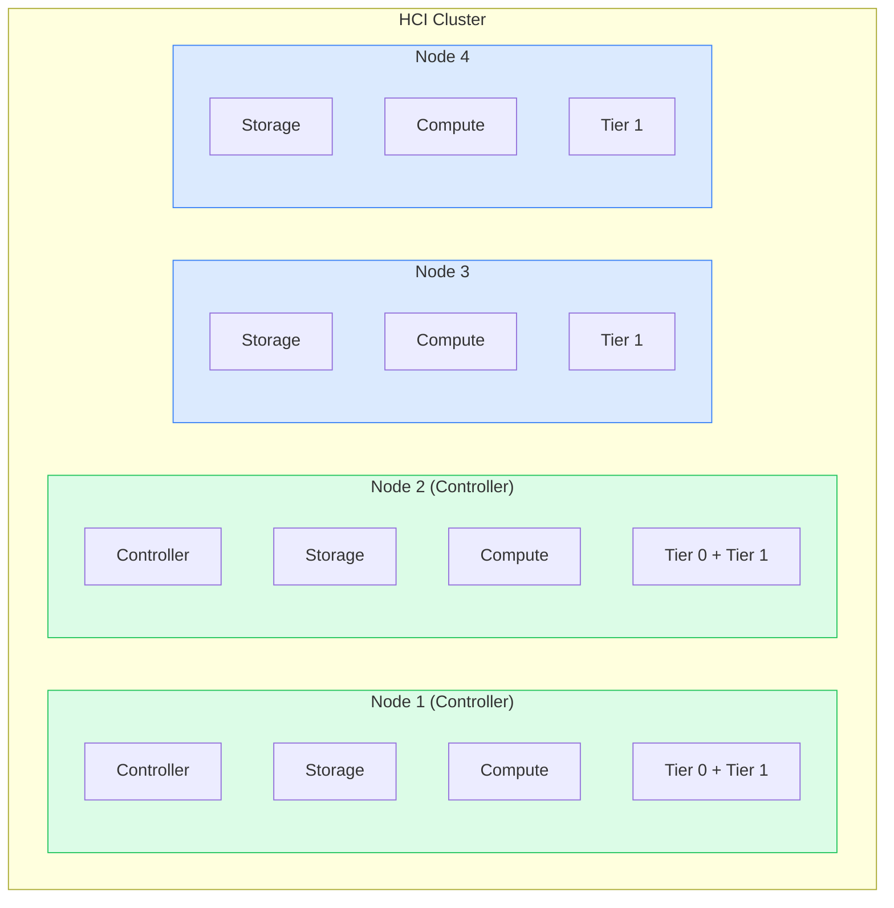

# HCI Architecture

VergeOS Hyperconverged Infrastructure (HCI) architecture combines compute, storage, and networking functions within the same physical nodes. This approach delivers operational simplicity and balanced resource scaling, making it ideal for smaller deployments.

HCI is recommended for deployments where compute and storage needs grow proportionally and unified scaling is preferred.

## Overview

!!! note "Node Roles"
    Nodes 1 & 2 (green) are controller nodes with Tier 0 storage. Nodes 3+ (blue) are HCI nodes without Tier 0.

## Advantages and Limitations

=== "Advantages"

    - **Operational simplicity** - Unified management across all resources
    - **Predictable scaling** - Resources grow together proportionally
    - **Lower initial complexity** - Fewer moving parts to manage
    - **Single hardware specification** - Simplifies procurement and spares
    - **Lower initial investment** - Start with 2-3 nodes minimum

=== "Considerations"

    - **Unified scaling** - Adding compute requires adding storage (and vice versa)
    - **Standard hardware** - No support for GPU or specialized compute nodes
    - **Shared resources** - Workloads share node resources with storage operations

## Node Configuration

### Controller Nodes (Node 1 & 2)

Controller nodes handle management, API operations, and metadata functions in addition to compute and storage workloads.

| Function | Description |
|----------|-------------|
| Controller | API operations, cluster coordination, metadata management |
| Storage | Tier 0 (metadata) + Tier 1+ (workload tiers) |
| Compute | VM workloads (minimize heavy workloads on controllers) |

### HCI Nodes (Node 3+)

Additional HCI nodes provide compute and storage capacity without controller functions.

| Function | Description |
|----------|-------------|
| Storage | Tier 1+ workload tiers only (no Tier 0) |
| Compute | Full compute capacity for VM workloads |

## Storage Distribution

### Tier 0 (Metadata) Configuration

!!! danger "Critical Requirement"
    Tier 0 must be present on Node 1 and Node 2 only (controller nodes). Never add Tier 0 to non-controller nodes.

| Property | Specification |
|----------|---------------|
| **Storage Type** | High-endurance NVMe (enterprise-grade) |
| **Sizing Formula** | 10GB per 1TB of total usable vSAN capacity |
| **Purpose** | vSAN metadata and system operations |

### Tier 0 Sizing Examples

| Usable Storage Target | Required Tier 0 per Controller | Total Tier 0 Required |
|----------------------|-------------------------------|----------------------|
| 50TB usable | 500GB per node | 1TB total (2x 500GB) |
| 100TB usable | 1TB per node | 2TB total (2x 1TB) |
| 200TB usable | 2TB per node | 4TB total (2x 2TB) |

!!! warning "Plan for Growth"
    Always size Tier 0 according to your maximum planned usable capacity, not current capacity. Undersizing will cause performance degradation and prevent cluster expansion.

### Workload Tier Distribution

Workload tiers (Tier 1, 2, 3+) are distributed across all nodes in the cluster. Each node contributes equally to storage tier capacity for balanced distribution and optimal performance.

**Example 4-Node HCI Storage Layout:**

| Node | Tier 0 | Tier 1 | Total per Node | Function |
|------|--------|--------|----------------|----------|
| Node 1 | 2x 3.84TB NVMe | 4x 7TB NVMe | ~36TB Raw | Controller + Storage + Compute |
| Node 2 | 2x 3.84TB NVMe | 4x 7TB NVMe | ~36TB Raw | Controller + Storage + Compute |
| Node 3 | - | 4x 7TB NVMe | ~28TB Raw | Storage + Compute |
| Node 4 | - | 4x 7TB NVMe | ~28TB Raw | Storage + Compute |
| **Cluster Total** | ~15TB Raw | ~112TB Raw | ~127TB Raw | ~56TB Usable in Tier 1 (N+1) |

!!! info "Redundancy"
    VergeOS vSAN maintains N+1 redundancy, meaning usable capacity is approximately 50% of raw capacity.

## Hardware Requirements

### Node Specification Consistency

For optimal HCI performance, maintain hardware consistency across nodes. Inconsistent hardware can lead to performance imbalances and operational complexity.

#### CPU Requirements

- Same CPU architecture (Intel or AMD, not mixed)
- Consistent core count preferred
- Similar CPU generation for feature compatibility
- Matching CPU frequencies for balanced workload distribution

#### Memory Configuration

- Identical memory capacity per node recommended
- Consistent memory speed (DDR4-3200, DDR5-4800, etc.)
- Plan for vSAN storage buffer (2GB+ per node)
- Reserve memory for controller operations on Node 1 & 2

#### Storage Consistency

- Identical storage device types within each tier
- Match drive capacities across nodes
- Enterprise-grade storage for Tier 0 (high endurance)
- Plan for future expansion with additional drive slots

#### Network Requirements

- Minimum 10GbE for core network between nodes
- 25GbE or higher recommended for production
- Redundant network paths for high availability
- Dedicated external network for VM traffic

### Controller Node Requirements

Nodes 1 and 2 serve as controller nodes and have specific requirements:

- [x] **High-endurance Tier 0 storage** - Enterprise NVMe for metadata operations
- [x] **Adequate memory allocation** - Reserve memory for storage buffer and controller functions
- [x] **Minimize heavy workloads** - Avoid compute-intensive workloads on controller nodes for best performance

### Typical Node Specifications

| Component | Small Deployment | Medium Deployment | Large Deployment |
|-----------|-----------------|-------------------|------------------|
| **Node Count** | 2-3 nodes | 4-6 nodes | 6+ nodes |
| **CPU** | 8-16 cores | 16-32 cores | 32-64 cores |
| **Memory** | 128-256GB | 256-512GB | 512GB-1TB |
| **Tier 0 (Controllers)** | 2x 480GB NVMe | 2x 1TB NVMe | 2x 2TB NVMe |
| **Tier 1 (All Nodes)** | 4-6x NVMe/SSD | 6-10x NVMe/SSD | 10-12x NVMe/SSD |
| **Network** | 10GbE | 25GbE | 25-100GbE |

## Scaling Considerations

### When to Scale Your HCI Cluster

Monitor these indicators to determine when scaling is needed:

=== "CPU Utilization"

    - Consistent CPU utilization above 70% across nodes
    - Increasing CPU ready time on VMs
    - Performance degradation during peak usage
    - Insufficient capacity for planned workloads

=== "Storage Capacity"

    - Storage tier utilization approaching 70%
    - Insufficient space for snapshots
    - Growth trends indicate exhaustion in 3-6 months
    - Need for additional storage tiers

=== "Memory Pressure"

    - Memory utilization consistently above 80%
    - Memory ballooning or swapping on VMs
    - Unable to allocate requested memory
    - Performance impact from memory contention

=== "Network"

    - Core network utilization approaching limits
    - Increased storage latency from saturation
    - VM network performance degradation
    - Need for higher bandwidth applications

### When to Consider Other Architectures

As your HCI deployment grows, you may benefit from transitioning to other architectures based on your specific needs.

#### Resource Imbalance Indicators

| Indicator | Description | Recommended Action |
|-----------|-------------|-------------------|
| **Compute Outpacing Storage** | Adding nodes primarily for CPU/memory while storage remains underutilized | Consider [HCI + Dedicated Compute](hci-compute.md) |
| **Storage Outpacing Compute** | Storage capacity requirements growing faster than compute needs | Consider [UCI Architecture](uci.md) |
| **Specialized Hardware Needed** | Need for GPU nodes, high-memory configurations, or different CPU architectures | Consider [UCI Architecture](uci.md) |

### Adding Nodes to HCI Cluster

1. **Procure Matching Hardware** - Ensure new node matches existing node specifications for CPU, memory, storage, and network
2. **Physical Installation** - Install and cable node in rack with proper power and network connectivity
3. **Configure Storage Tiers** - Match storage tier distribution of existing nodes (no Tier 0 on Node 3+)
4. **Allow vSAN Synchronization** - Data rebalancing may take several hours depending on cluster size
5. **Verify Integration** - Test compute and storage functionality, confirm node health in UI

## Storage Best Practices

- [x] **Device Consistency** - Use identical storage device types and capacities within each tier across all nodes
- [x] **Minimize Tier Complexity** - Use 1-2 workload tiers maximum for HCI simplicity; more tiers increase management overhead
- [x] **Storage Buffer Allocation** - Default 2GB per node may be insufficient for larger deployments; increase to 4-8GB for 4-6 node clusters

## Use Cases

HCI architecture is ideal for:

| Use Case | Description |
|----------|-------------|
| **Proportional Growth** | Compute and storage grow together |
| **Standardized Hardware** | Single hardware specification preferred |
| **Branch/Remote Offices** | Edge deployments with unified management |
| **Development/Test** | Non-production environments |
| **Disaster Recovery** | Secondary sites with balanced workloads |

## Migration Paths

When your requirements change, consider these migration paths:

### To HCI + Dedicated Compute

Best when compute demand exceeds storage growth.

- Existing HCI becomes storage foundation
- Add compute-only cluster for independent scaling
- Straightforward transition
- Minimal service disruption

[Learn more about HCI + Dedicated Compute](hci-compute.md)

### To UCI Architecture

Best when requiring maximum workload isolation or specialized hardware.

- Separate controller, storage, and compute functions
- Purpose-built clusters for each function
- Maximum resource isolation

[Learn more about UCI Architecture](uci.md)
