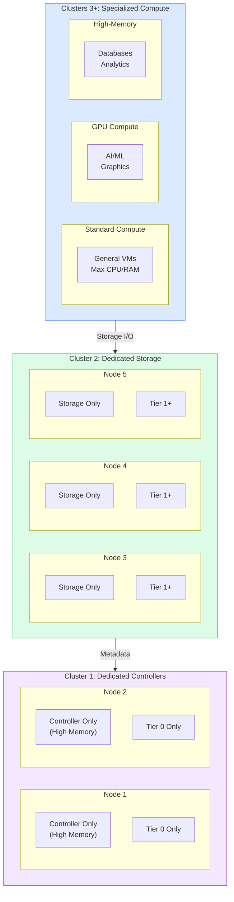

# UCI Architecture

VergeOS UCI (Ultra Converged Infrastructure) architecture provides complete separation of controller, storage, and compute functions. This three-cluster design enables maximum workload isolation, independent scaling, and purpose-built optimization for each resource type.

UCI is ideal for environments requiring specialized hardware (GPU, high-memory), maximum resource isolation, or independent scaling of storage and compute.

## Overview



!!! note "Storage Tiers"
    This example uses a single workload tier of storage (Tier 1). VergeOS supports up to 5 workload Storage Tiers in a single System.

## Three-Cluster Model

### Cluster 1: Dedicated Controllers

Controller nodes handle all management, API operations, and metadata functions without any compute workload interference.

| Property | Specification |
|----------|---------------|
| **Node Count** | 2 nodes (required) |
| **Functions** | API operations, cluster coordination, metadata management |
| **Storage** | Tier 0 only (no workload tiers) |
| **Memory** | High capacity (1TB+) for metadata caching |
| **Compute** | Disabled - no VM workloads |

### Cluster 2: Dedicated Storage

Storage nodes provide pure storage capacity and I/O performance without any compute overhead.

| Property | Specification |
|----------|---------------|
| **Node Count** | 3+ nodes (minimum 3 for balanced distribution) |
| **Functions** | Storage I/O processing |
| **Storage** | Tier 1+ workload tiers only (no Tier 0) |
| **Drive Density** | Maximum drive density (4+ drives per node) |
| **Compute** | Disabled - no VM workloads |

### Clusters 3+: Specialized Compute

Compute clusters are purpose-built for specific workload types.

| Cluster Type | Use Cases | Hardware Profile |
|-------------|-----------|------------------|
| **Standard Compute** | Web servers, app servers, general VMs | Max CPU/RAM |
| **GPU Compute** | AI/ML, graphics rendering, video encoding | Enterprise GPUs |
| **High-Memory** | Databases, analytics, in-memory apps | 2TB-8TB+ RAM |
| **CPU-Intensive** | Scientific compute, rendering, simulation | Max cores/frequency |

## Cluster Specialization Benefits

=== "Dedicated Controllers (Cluster 1)"

    - **Maximum management performance** - All resources dedicated to API, metadata, and cluster management
    - **Optimized memory allocation** - 750GB+ RAM for metadata caching and storage buffer operations
    - **High availability** - Multiple controller nodes for redundancy without compute interference
    - **Predictable performance** - No compute workloads to create resource contention

=== "Dedicated Storage (Cluster 2)"

    - **Maximum I/O performance** - All node resources dedicated to storage operations
    - **Optimized hardware** - Storage-optimized servers with maximum drive density
    - **Independent scaling** - Add storage capacity without affecting compute resources
    - **Performance isolation** - No compute overhead impacting storage performance

=== "Specialized Compute (Cluster 3+)"

    - **Maximum compute efficiency** - All resources available for VM workloads
    - **Hardware specialization** - Different node types optimized for specific workloads
    - **Flexible growth** - Scale compute independently based on workload demands
    - **Workload isolation** - Separate different types of compute workloads

## Controller Cluster Design

### Controller Hardware Specifications

| Component | Specification | Purpose |
|-----------|---------------|---------|
| **CPU** | 1 x 3GHz+, 8-32 cores | Management and API operations |
| **Memory** | 1TB+ (750GB minimum) | Metadata cache and storage buffer |
| **Tier 0 Storage** | 2 x high-endurance NVMe | vSAN metadata operations |
| **Network** | 25-100GbE | Management and storage traffic |

**CPU Requirements:**

- 1 x 3GHz+ processor
- 8-32 cores recommended
- Focus on management workloads
- Not compute-intensive

**Memory Requirements:**

- **1TB+** for large deployments
- 750GB+ minimum recommended
- Metadata caching
- Storage buffer operations

**Storage Requirements:**

- **Tier 0 Only**
- 2 x high-endurance NVMe
- 10GB per 1TB usable capacity
- Enterprise-grade required

### Controller Optimization

**Storage Buffer Allocation:**

Set storage buffer allocation to **75% of RAM** per controller node for optimal metadata caching and storage operations.

!!! example "Calculation Example"
    1TB RAM × 75% = 750GB storage buffer per controller

**Workload Restrictions:**

- Disable compute workload scheduling on controllers
- Optimize network settings for management traffic
- Ensure no VM workloads running on controller nodes
- Reserve all resources for management functions

### Controller High Availability

- Ensure both controllers are fully operational at all times
- Test failover scenarios between controllers regularly
- Configure monitoring and alerting for controller health
- Maintain identical hardware specifications across both nodes

## Storage Cluster Design

### Storage Node Hardware Specifications

| Component | Specification | Purpose |
|-----------|---------------|---------|
| **CPU** | 1 x 3GHz+, 1 core per disk | Storage I/O processing |
| **Memory** | 256-512GB (2GB per TB raw) | Storage buffer and caching |
| **Storage** | Maximum drive density (4+ drives) | vSAN workload tiers (Tier 1+) |
| **Network** | 25-100GbE (high bandwidth) | Storage traffic to compute clusters |

!!! danger "Tier 0 Placement"
    Storage nodes in UCI do NOT contain Tier 0 storage. Tier 0 exists only on dedicated controller nodes. Storage cluster nodes contain Tier 1+ (workload tiers) only.

### Storage Tier Distribution

**Tier Distribution Pattern:**

- **Tier 1+** workload tiers distributed across all storage nodes
- Each node contributes equally to storage tier capacity
- Maintain consistent drive configurations within tiers
- Plan for different performance tiers based on workload requirements

**Example Storage Layout:**

| Node | Tier 1 (Performance) | Tier 2 (Capacity) | Total Raw |
|------|---------------------|-------------------|-----------|
| Storage Node 1 | 10x 7TB NVMe | 12x 16TB SATA SSD | ~262TB |
| Storage Node 2 | 10x 7TB NVMe | 12x 16TB SATA SSD | ~262TB |
| Storage Node 3 | 10x 7TB NVMe | 12x 16TB SATA SSD | ~262TB |
| **Cluster Total** | ~210TB Raw (105TB Usable) | ~576TB Raw (288TB Usable) | ~786TB Raw |

!!! info "Redundancy"
    N+1 redundancy means approximately 50% usable capacity.

### Storage Cluster Optimization

**Device Consistency:**

- Use identical storage device types within each tier
- Match drive capacities across all storage nodes
- Never mix storage types within the same tier (e.g., NVMe and SATA)
- Maintain consistent firmware versions across all storage devices
- Replace failed drives with identical specifications

**Balanced Distribution:**

- Ensure equal storage contribution from each node in each tier
- Monitor tier utilization across nodes for imbalances
- Rebalance storage distribution if nodes show significant variance
- Add storage capacity proportionally across all nodes

**Storage Buffer Allocation:**

| Cluster Size | Buffer per Node |
|-------------|-----------------|
| Small (<100TB) | 4-8GB |
| Medium (100-500TB) | 8-16GB |
| Large (500TB+) | 16-32GB+ |

## Compute Cluster Design

### Standard Compute Nodes

| Component | Specification | Purpose |
|-----------|---------------|---------|
| **CPU** | Maximum cores (32-64+) | General-purpose VM workloads |
| **Memory** | 512GB-2TB+ | VM memory requirements |
| **Storage** | Minimal (OS and cache) | Boot disk only |
| **Network** | 25-100GbE | Storage and VM traffic |

### GPU Compute Nodes

**Hardware Requirements:**

- High core count CPU for GPU support
- High capacity memory for GPU workloads
- Enterprise-grade GPUs (NVIDIA Tesla/A100, etc.)
- Enhanced cooling for GPU operations
- High-capacity power delivery

**Use Cases:**

- Machine learning model training
- AI inference workloads
- Graphics rendering and visualization
- Video encoding/transcoding
- Scientific simulations

### High-Memory Compute Nodes

**Hardware Requirements:**

- Moderate to high core count CPU
- **Ultra-high capacity memory (2TB-8TB+)**
- Minimal local storage requirements
- High-bandwidth memory architecture

**Use Cases:**

- In-memory databases (SAP HANA, etc.)
- Large-scale analytics platforms
- Big data processing (Spark, Hadoop)
- Real-time data warehouses
- Memory-intensive simulations

### CPU-Intensive Compute Nodes

**Hardware Requirements:**

- **Maximum core count and frequency**
- Adequate memory for CPU workloads
- Enhanced cooling for high CPU utilization
- Optimized power delivery

**Use Cases:**

- Scientific computing and research
- 3D rendering and animation
- Financial modeling and simulation
- Code compilation and CI/CD
- Multi-threaded parallel processing

### Compute Cluster Management

**Workload Placement Strategies:**

- Match workloads to appropriate specialized compute clusters
- Distribute VMs across compute nodes for load balancing
- Implement VM anti-affinity rules for high availability
- Monitor resource utilization across all compute clusters

**Resource Optimization:**

- Configure CPU and memory oversubscription ratios per cluster type
- Maximize resources available for VM workloads
- Implement appropriate VM placement and balancing policies
- Plan for N+1 compute capacity to handle node failures

## Network Architecture

UCI architecture requires high-bandwidth, low-latency networking between all three cluster types. The network infrastructure is critical to UCI performance, as controller operations, storage I/O, and compute workloads all depend on efficient inter-cluster communication.

### Network Topology

```
                ┌─────────────────────────────────┐
                │    External Network (VM)        │
                │    Based on requirements        │
                └────────┬────────────────────────┘
                         │
          ┌──────────────┼──────────────┐
          │              │              │
┌─────────▼────────┐ ┌──▼───────┐ ┌───▼──────────┐
│  Controller      │ │ Storage  │ │  Compute     │
│  Cluster         │ │ Cluster  │ │  Clusters    │
│  Node 1-2        │ │ Node 3-N │ │  Node 5-N    │
└─────────┬────────┘ └──┬───────┘ └───┬──────────┘
          │              │              │
          │    ┌─────────┼──────────────┘
          │    │         │
          └────┼─────────┘
               │
    ┌──────────▼──────────────────────────────┐
    │   Core Network (Storage Traffic)        │
    │   100GbE Recommended                    │
    │   High bandwidth critical for UCI       │
    └─────────────────────────────────────────┘
               │
    ┌──────────▼──────────────────────────────┐
    │   Management Network                    │
    │   25GbE for control plane               │
    └─────────────────────────────────────────┘
```

### Network Bandwidth Planning

| Communication Path | Bandwidth | Description |
|-------------------|-----------|-------------|
| **Controller to Storage** | 40-100GbE | High bandwidth for metadata operations |
| **Storage to Compute** | **100GbE (critical)** | Maximum bandwidth - all VM I/O flows here |
| **Controller to Compute** | 25-40GbE | Moderate bandwidth for management operations |

### Recommended Network Specifications

| Network Type | Minimum | Recommended | High-Performance | Purpose |
|-------------|---------|-------------|------------------|---------|
| **Core Network** (Storage traffic) | 40GbE | **100GbE** | 200GbE+ | Primary storage I/O path |
| **Management Network** | 10GbE | 25GbE | 40GbE | Control plane operations |
| **External Network** (VM traffic) | 10GbE | 25-40GbE | Based on workload | VM ingress/egress traffic |

!!! danger "Critical: Core Network"
    The core network (storage traffic) is the most important network in UCI. Undersizing this network will create a significant bottleneck affecting all VM I/O operations. **100GbE is strongly recommended for production UCI deployments.**

### Network Topology Options

=== "Flat Network Architecture"

    - **Design:** Single high-bandwidth network for all traffic
    - **Pros:** Simpler configuration, lower switch count
    - **Cons:** Traffic contention possible, less isolation
    - **Best for:** Smaller UCI deployments (10-15 nodes)

=== "Separated Network Architecture"

    - **Design:** Dedicated networks for storage, management, VM traffic
    - **Pros:** Maximum performance, traffic isolation
    - **Cons:** More complex, higher switch cost
    - **Best for:** Larger UCI deployments (15+ nodes)

### Network Optimization Strategies

**Traffic Separation:**

- Utilize dedicated network interfaces or VLANs for different traffic types
- Separate storage traffic from management and VM networks
- Implement QoS policies to prioritize storage traffic
- Use jumbo frames (9000 MTU) on storage network

**Redundancy and High Availability:**

- Implement redundant network paths for all critical traffic
- Use link aggregation (LACP) for increased bandwidth and failover
- Deploy redundant core switches for network resilience
- Configure multiple NICs per node for network redundancy

**Performance Monitoring:**

- Monitor network utilization across all inter-cluster links
- Track latency between all cluster pairs continuously
- Implement alerting for network saturation (>70% utilization)
- Use VergeOS network monitoring tools to identify bottlenecks

### Common Network Issues and Solutions

| Issue | Symptoms | Solution |
|-------|----------|----------|
| **Storage Network Saturation** | High VM I/O latency, poor IOPS | Upgrade to higher bandwidth (40→100GbE) |
| **Network Packet Loss** | Intermittent performance issues | Check switch configuration, cable quality |
| **High Inter-Cluster Latency** | Slow management operations | Verify network path, reduce switch hops |
| **Unbalanced Traffic** | Some links saturated, others idle | Configure proper LACP and load balancing |

## Scaling Strategies

UCI architecture's greatest strength is the ability to scale each cluster type independently based on specific resource demands.

### Independent Scaling Overview

| Cluster Type | Scaling Approach | Trigger |
|-------------|------------------|---------|
| **Controller** | Scale Tier 0 storage and memory | Metadata demands grow |
| **Storage** | Add storage nodes | Capacity and performance needs |
| **Compute** | Add specialized compute nodes | Workload requirements |

### Controller Scaling

**When to Scale Controllers:**

- Total vSAN capacity approaching Tier 0 sizing limits (10GB per 1TB usable)
- Controller memory utilization consistently above 80%
- API response times increasing under load
- Metadata operations showing performance degradation

**Controller Scaling Options:**

- **Add Tier 0 Storage** - Expand Tier 0 capacity on existing controllers as vSAN grows
- **Increase Memory** - Add memory to controllers for larger metadata cache and storage buffer
- **Scale Storage Buffer Allocation** - Adjust storage buffer percentage based on total capacity

### Storage Scaling

**When to Scale Storage:**

- Storage tier utilization approaching 70% capacity
- Storage I/O performance degradation across cluster
- Need for additional storage tiers with different performance characteristics
- Growth projections indicate capacity exhaustion within 6 months

**Storage Scaling Strategies:**

| Strategy | Description | Recommendations |
|----------|-------------|-----------------|
| **Capacity Scaling** | Add storage nodes | Minimum 3 nodes, recommended 5-8 nodes, scale to 12+ for large deployments |
| **Performance Scaling** | Add drives to existing nodes | More IOPS, implement new tiers, upgrade to faster storage technology |

**Adding Storage Nodes:**

1. Determine storage capacity and performance requirements
2. Procure nodes matching existing storage cluster specifications
3. Install and configure new storage nodes with appropriate tiers
4. Allow vSAN to rebalance data across expanded storage cluster (may take hours)
5. Monitor storage distribution and performance after addition
6. Update Tier 0 capacity on controllers if total usable capacity increases significantly

### Compute Scaling

**When to Scale Compute:**

- Compute cluster CPU utilization consistently above 70%
- Memory utilization above 80% across compute nodes
- VM deployment requests cannot be fulfilled due to resource constraints
- New workload types requiring specialized hardware (GPU, high-memory)

**Compute Scaling Strategies:**

**Adding Nodes to Existing Compute Clusters:**

- Add compute nodes to existing standard compute cluster
- Match hardware specifications within each cluster for consistency
- Balance workloads across expanded compute capacity
- Implement VM placement policies for optimal distribution

**Creating New Specialized Compute Clusters:**

- Deploy GPU compute cluster for AI/ML workloads
- Create high-memory cluster for database and analytics workloads
- Implement CPU-intensive cluster for scientific computing
- Each specialized cluster optimized for specific workload requirements

### Compute-to-Storage Ratios

| Workload Type | Compute:Storage Ratio | Notes |
|--------------|----------------------|-------|
| **General Enterprise** | 4-5:1 | Balanced compute and storage growth |
| **VDI/Desktop** | 6-8:1 | High compute density, moderate storage |
| **AI/ML** | 3-4:1 | GPU nodes, high-performance storage |
| **Database/Analytics** | 2-3:1 | High-memory nodes, fast storage |
| **Archive/Backup** | 8-10:1 | Standard compute, high-capacity storage |

### Network Scaling Considerations

As UCI clusters scale, network bandwidth requirements increase proportionally:

- **Storage cluster growth:** More storage nodes = more aggregate storage I/O capacity = higher network bandwidth needs
- **Compute cluster growth:** More compute nodes = more concurrent VM I/O = increased storage network traffic
- **Monitor utilization:** Track core network utilization and upgrade proactively at 70% sustained utilization

## Enterprise Considerations

### Multi-Tenant Deployments

**Tenant Isolation Strategies:**

- Dedicated compute clusters per major tenant for resource isolation
- Shared storage cluster with tenant-specific tiers for cost efficiency
- Network segmentation and isolation per tenant
- Resource allocation and billing granularity per tenant

**Service Provider Benefits:**

- Maximum resource efficiency through hardware specialization
- Flexible service offerings based on specialized hardware types
- Independent scaling of services without affecting other tenants
- Comprehensive monitoring and billing capabilities per tenant

### Disaster Recovery and High Availability

**Cluster-Level Redundancy:**

- Multi-site controller deployment for geographic redundancy
- Storage replication across sites for disaster recovery
- Compute cluster failover capabilities between sites
- Network redundancy and failover at all levels

**Maintenance and Updates:**

- Cluster-by-cluster maintenance windows minimize service impact
- Rolling updates with minimal disruption to running workloads
- Independent testing and validation per cluster type
- Planned maintenance doesn't require full system downtime

## Best Practices

### Scaling Best Practices

- [x] **Scale Proactively** - Add capacity before reaching 70% utilization
- [x] **Monitor All Cluster Types** - Track utilization across controllers, storage, and compute
- [x] **Plan for Growth** - Develop 12-18 month capacity plans per cluster type
- [x] **Scale Network Infrastructure** - Upgrade networking as cluster sizes increase
- [x] **Maintain Hardware Consistency** - Use similar specs within each cluster type
- [x] **Document Changes** - Track all scaling activities and configurations

### Network Best Practices

- [x] **Over-provision Storage Network** - 100GbE minimum for production UCI deployments
- [x] **Implement Full Redundancy** - Multiple network paths and redundant switches
- [x] **Separate Traffic Types** - Dedicated networks or VLANs per traffic type
- [x] **Monitor Proactively** - Track utilization and latency continuously
- [x] **Use Jumbo Frames** - 9000 MTU on storage network for efficiency
- [x] **Plan for Growth** - Size network for 2-3 years of expansion

## UCI vs. Other Architectures

| Requirement | HCI | HCI + Compute | UCI |
|-------------|-----|---------------|-----|
| **Workload Isolation** | Shared | Compute isolated | **Full isolation** |
| **Hardware Flexibility** | Uniform | Some variation | **Maximum** |
| **Independent Scaling** | No | Compute only | **All resources** |
| **Specialized Hardware** | Not supported | Limited | **Full support** |
| **Resource Contention** | Possible | Reduced | **Eliminated** |

## When to Choose UCI

**Choose UCI when:**

- You want complete isolation between workloads and storage/controller functions
- You need specialized compute resources (GPU, high-memory nodes)
- Independent scaling of storage and compute is important
- Multi-tenant environments requiring resource isolation
- Maximum I/O performance for storage-intensive applications

## Design Considerations

- More clusters to configure initially (controller, storage, compute)
- Capacity planning across independent resource pools
- Higher network bandwidth requirements between clusters

!!! info "Isolation Benefits"
    UCI's separation of functions means workloads cannot interfere with storage or controller operations. Each cluster type operates independently, providing predictable performance and simplified troubleshooting when issues are isolated to specific resource types.
