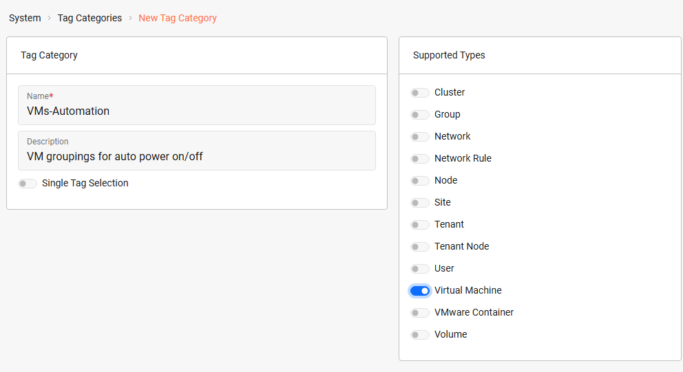
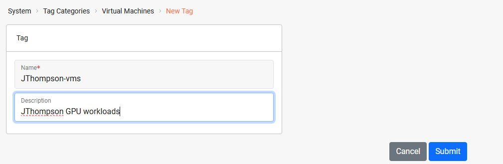
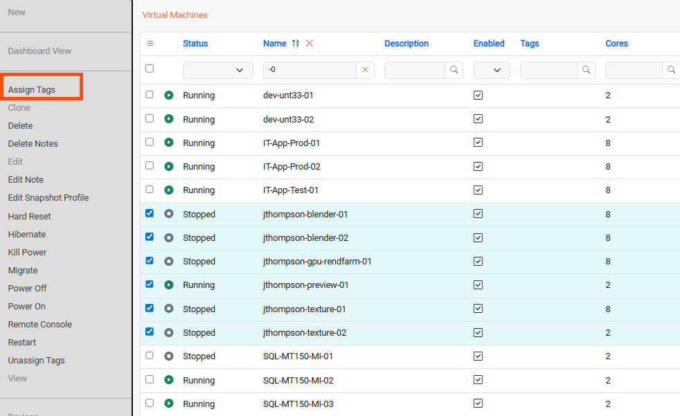
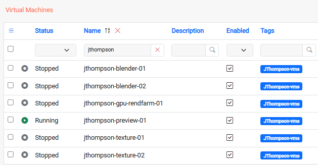
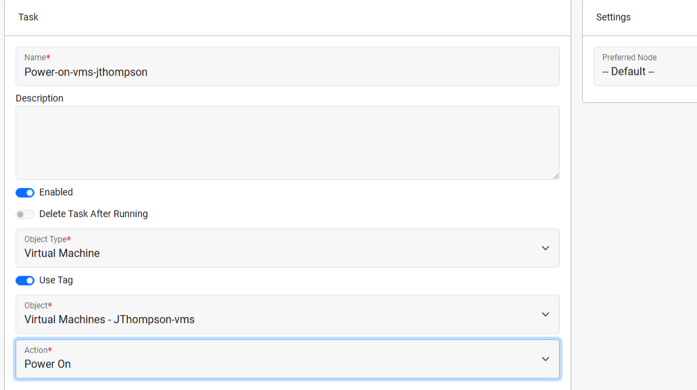
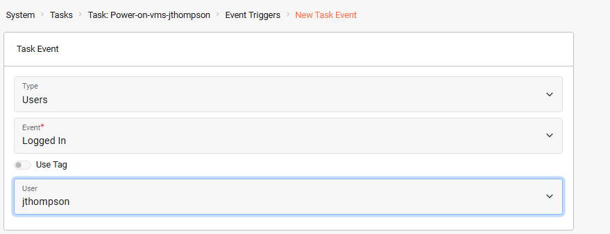
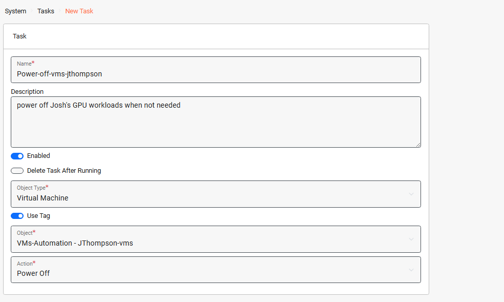
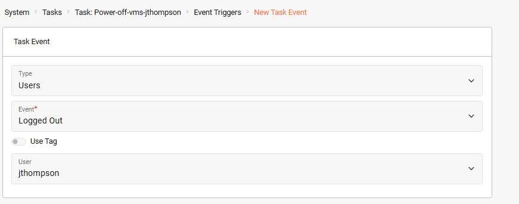
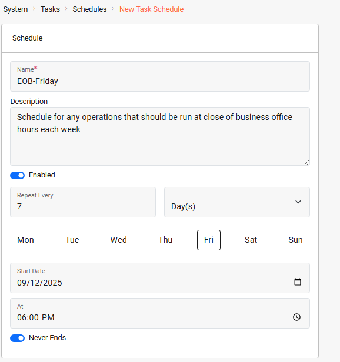
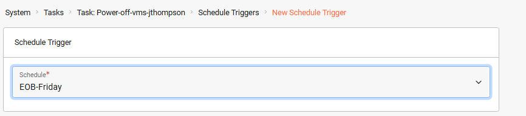

# Power on/Power off VMs Based on User Login/Logout and Schedule
## Automated Task Example


**Key Points**

* The ***VergeOS Task Engine*** allows you to automate operations, triggered by specific events or scheduled times. Using modular, reusable components (tasks, events, schedules, and webhooks) you can easily configure automation tailored to your environment.
* The following example displays the use of tags, tasks, events and schedules used together to seamlessly bring workloads online and offline as they are needed, improving resource efficiency.


#### Use Case

User JThompson relies on multiple GPU-powered virtual machines to perform 3D modeling and animation work. These VMs consume significant compute and memory resources, and leaving them running when idle is wasteful.

By configuring automation to power them on only when needed - when JThompson logs into the system, and to shut them down when the user logs out or at a scheduled time (for example, every Friday at 6pm), we can ensure that resources are available exactly when needed while avoiding unnecessary usage.

The automation consists of creating tags, defining tasks, and attaching event and schedule triggers. The steps below walk you through the full configuration:

1. Create a Tag Category and Tag

**A tag category organizes related tags. We then create a specific tag within that category to designate the VMs to control with this automation.**

***System >  Tags >  New***

**Double-click category created above >**  ***New***

2. Assign the Tag to the VMs to Automatically Power On/Off

**This will identify the VMs that should be controlled by the automation.**

***Virtual Machines >  List >***  **select VMs >**  ***Assign Tags*** **> select the tag from above**

The VMs will now show the assigned tag in the ***Tags*** column.

3. Create a Task to Power On VMs

**This task defines the action of starting up the tagged virtual machines.**

***System > Tasks Dashboard > New Task***

4. Configure an Event Trigger for User Login

**Here we define the activity that will invoke the task (JThompson logs into the system).**

From the new task dashboard:
***Event Triggers > New***

5. Create a Task to Power Off the VMs

**This defines the action of powering down the tagged virtual machines.**

***System > Tasks Dashboard > New Task***

6. Configure an Event Trigger for User Logout

**This configures the task to launch when JThompson logs out.**

From the new task dashboard:
***Event Triggers > New***

7. Create a Schedule for Fridays at 6:00pm

**Creating a schedule allows us to define specific dates/times.  After creating the schedule it can be applied to our task and other tasks.**

***System > Tasks Dashboard > New Schedule***

8. Create a Schedule Trigger for the Power Off

**We apply the schedule (Fridays at 6pm) to the task to automatically power off the VMs every Friday evening.**

From the dashboard of the new task:
***Schedule Triggers > New***

### Verification
- Log in as JThompson → tagged VMs should power on automatically
- Log out → VMs should power off
- At Friday 6:00pm → VMs should power off even if the user is still logged in

### Troubleshooting
- If VMs do not power on, verify the tag is assigned to each VM.
- If schedule triggers do not fire, confirm the system time zone is correct.
- If login/logout triggers fail, ensure the user account name matches exactly.

This automation ensures that the GPU‑powered VMs are only active when the designated user is logged in. When the user logs out, or at the scheduled cutoff time (Friday 6pm), the VMs are powered down to conserve resources. The pattern can be applied to other high‑resource workloads such as integration test environments, interactive machine learning, CAD rendering stations, or financial modeling clusters, or any system that benefits from running only when needed.
