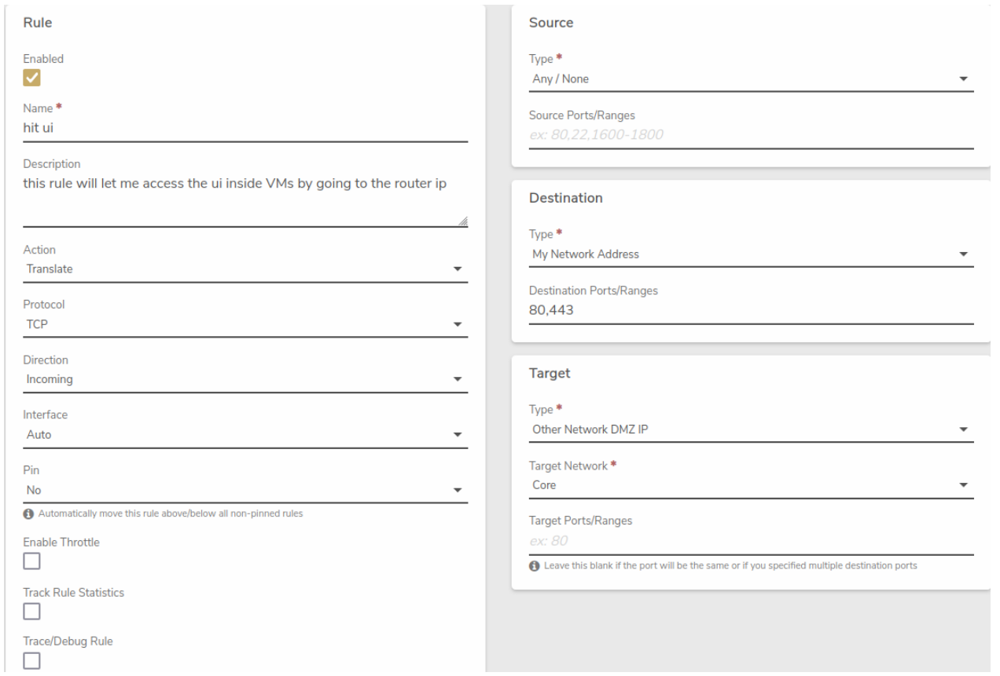

# Accessing the Verge.io UI from a VM

## Overview


**Key Points**

- Access the VergeOS UI from a VM within your environment
- Utilize hair-pinning network technique
- Create a specific network rule on the internal network


This article guides you through the process of setting up access to the VergeOS User Interface (UI) from a virtual machine (VM) running inside the VergeOS system. This is accomplished using a networking technique known as hair-pinning, where a packet travels to an interface, goes out towards the Internet, but instead of continuing, it makes a "hairpin turn" and comes back in on the same interface.

## Prerequisites

- A running VergeOS environment
- A virtual machine (VM) within your VergeOS environment
- Access to the VergeOS UI
- Basic understanding of network rules in VergeOS

## Steps

1. Navigate to the Internal Network
   - Log into your VergeOS environment
   - Go to the internal network that your target VM is connected to

2. Create a New Rule
   - Locate the option to create a new rule
   - Configure the rule with the following settings:

     **Rule:**
     - Name: Use a reference name, such as "Allow UI"
     - Action: Translate
     - Protocol: TCP
     - Direction: Incoming
     - Interface: Auto
     - Pin: No

     **Source:**
     - Type: Any / None
     - Source Ports/Ranges: Leave blank

     **Destination:**
     - Type: My Network Address
     - Destination Ports/Ranges: 80, 443

     **Target:**
     - Type: Other Network DMZ IP
     - Target Network: Core
     - Target Ports/Ranges: Leave blank

3. Submit the Rule
   - Click "Submit" to save the rule

4. Apply the New Rule
   - Click "Apply Rules" to activate the newly created rule

5. Access the UI from the VM
   - Open a web browser within your VM
   - Navigate to the IP address of the internal network (e.g., if the internal network IP is 192.168.0.1, use this address)


**Pro Tip**

Always ensure that your VM's network settings are correctly configured to use the internal network where you've set up this rule.


## Visual Guide

Here's a visual representation of the rule configuration:

## Troubleshooting


**Common Issues**

- Problem: Unable to access the UI after creating the rule
  - Solution:
    1. Verify that the rule is applied correctly
    2. Check if the VM's network interface is on the correct internal network
    3. Ensure no firewall rules are blocking the connection


## Additional Resources

- [Network Overview](https://docs.verge.io/product-guide/networks/network-overview/)
- [Network Rules](https://docs.verge.io/product-guide/networks/network-rules/)
- [Creating an Internal Network](https://docs.verge.io/product-guide/networks/internal-networks/)

## Feedback


**Need Help?**

If you encounter any issues while setting up UI access or have questions about this process, please don't hesitate to contact our support team.


---


**Document Information**

- Last Updated: 2024-08-29
- VergeOS Version: 4.13.3

