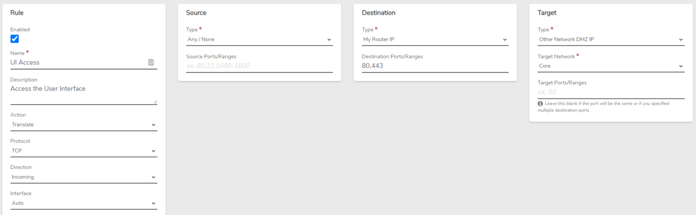

# Accessing the User Interface from an Internal Network

## Overview


**Key Points**

- Access the vergeOS UI from a VM within your environment
- Create a route rule on the internal network
- Simple process involving dashboard navigation and rule creation


This article guides you through the process of setting up access to the vergeOS User Interface (UI) from a virtual machine (VM) within your vergeOS environment. This is accomplished by creating a specific route rule on the network to which your VM is connected, typically an internal network.

## Prerequisites

- A running vergeOS environment
- A virtual machine (VM) within your vergeOS environment
- Access to the vergeOS dashboard
- Basic understanding of network rules in vergeOS

## Steps

1. Navigate to the Network Dashboard
   - Log into your vergeOS environment
   - Go to the dashboard of the network that your target VM is connected to

2. Create a New Rule
   - Locate the option to create a new rule
   - Use the settings shown in the image below:

   

3. Submit the Rule
   - After configuring the rule, submit it
   - You will be redirected to the list view of rules on the network

4. Apply the New Rule
   - Click "Apply Rules" to activate the newly created rule

5. Access the UI from the VM
   - Open a web browser within your VM
   - Navigate to the IP address of the Verge UI (e.g., `https://192.168.4.1`)


**Pro Tip**

Always ensure that your VM's network settings are correctly configured to use the internal network where you've set up this rule.


## Troubleshooting


**Common Issues**

- Problem: Unable to access the UI after creating the rule
  - Solution:
    1. Verify that the rule is applied correctly
    2. Check if the VM's network interface is on the correct network
    3. Ensure no firewall rules are blocking the connection


## Additional Resources

- [Network Overview](https://docs.verge.io/product-guide/networks/network-overview/)
- [Network Rules](https://docs.verge.io/product-guide/networks/network-rules/)
- [Creating an Internal Network](https://docs.verge.io/product-guide/networks/internal-networks/)

## Feedback


**Need Help?**

If you encounter any issues while setting up UI access or have questions about this process, please don't hesitate to contact our support team.


---


**Document Information**

- Last Updated: 2024-08-29
- vergeOS Version: 4.12.6

