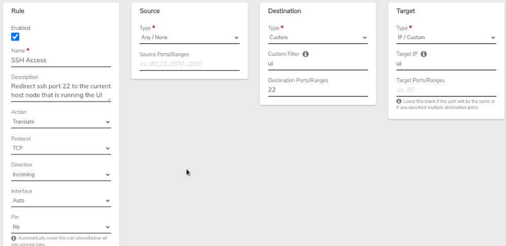
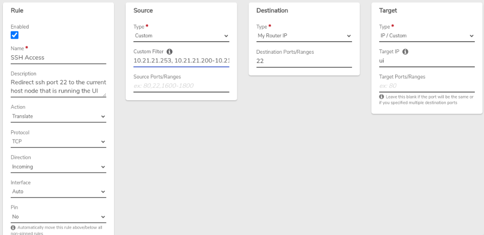

# Enabling System SSH Access


**Key Points**

- SSH access to a VergeOS system is generally not needed because full access is provided from the UI.
- SSH should only be enabled for specific hardware diagnostics or other special circumstances.
- Although VergeOS employs many safety protections, opening SSH on any system can introduce vulnerability.



**Important SSH Security Procedures**

- Always use source-controlled external rules to strictly limit ssh access to trusted addresses.
- Enable SSH access on a temporary basis; disable rules again when done with the session.


## Steps to Enable SSH access

SSH Access rules are auto-created, and disabled, during system installation.

1. **Enable the core network rule:** Navigate to the Core network dashboard, modify the ***"SSH Access"*** rule, select the **Enabled** option and **Submit** to save the change.

2. **Add source control to the external network rule:** Navigate to the external network dashboard, modify the ***"SSH Access"*** rule to **configure specific source IP address(es) and/or address range(s) to tightly control access**.
3. **Enable the external network rule:** select the **Enabled** option and **Submit** to save the change.
**Ex. External Network Rule:**

4. **Apply Rules** to both networks.

## Warning


- VergeOS is a specialized kernel, with a read-only overlay.  Do not install additional Debian packages or applications as they can conflict with VergeOS operation and cause system malfunction or data loss. Additionally, extraneous programs are wiped at reboot.
- Check with VergeOS support before making any modifications at the command line.  Issues resulting from unsanctioned command-line changes are the sole responsibility of the customer.

