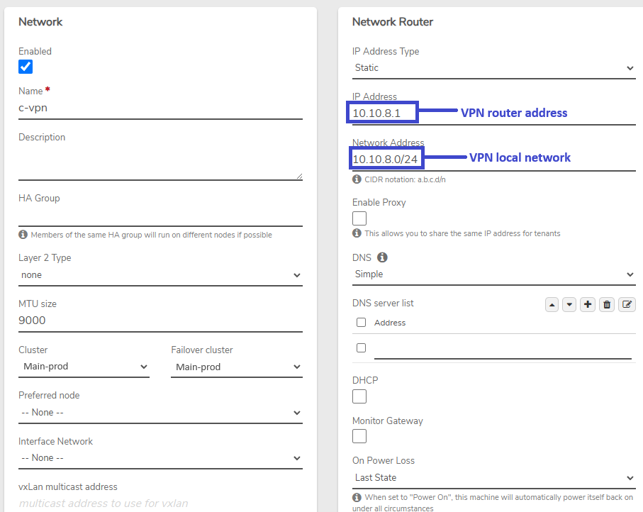
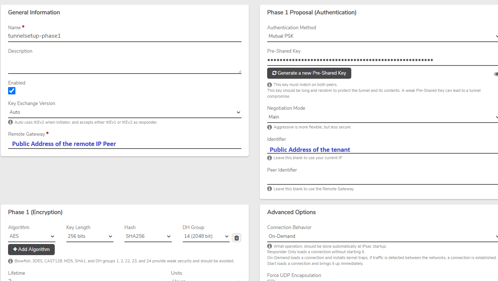
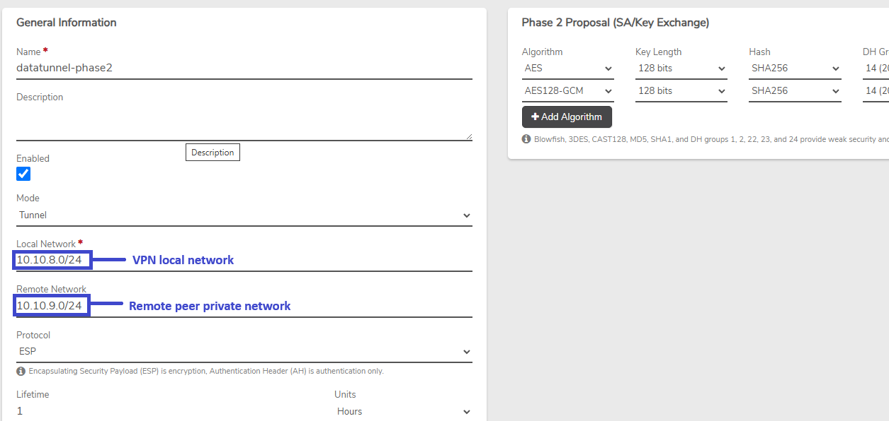
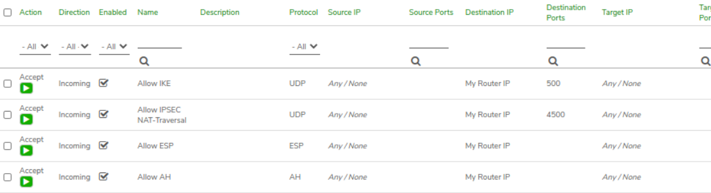
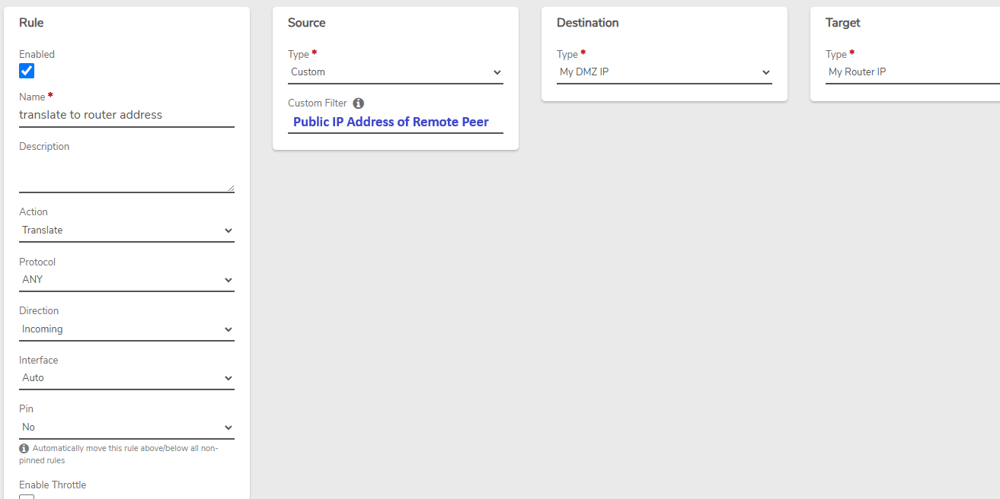
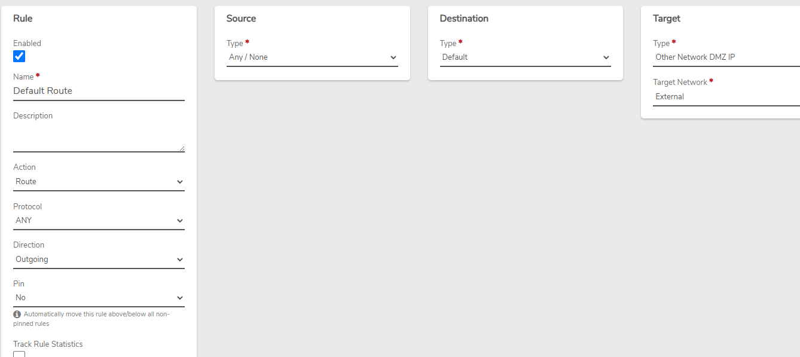
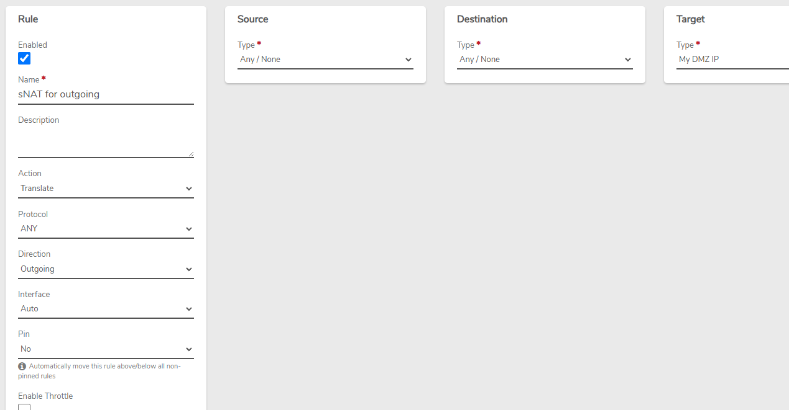
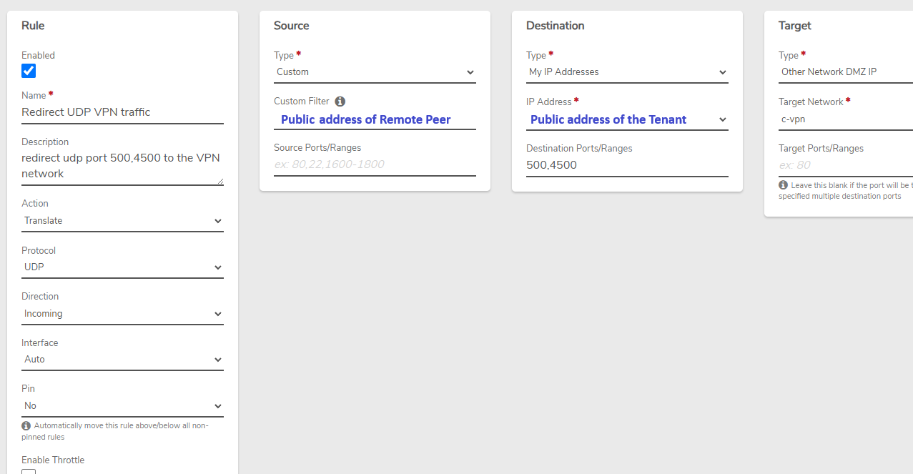
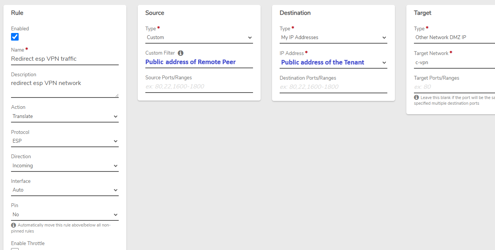
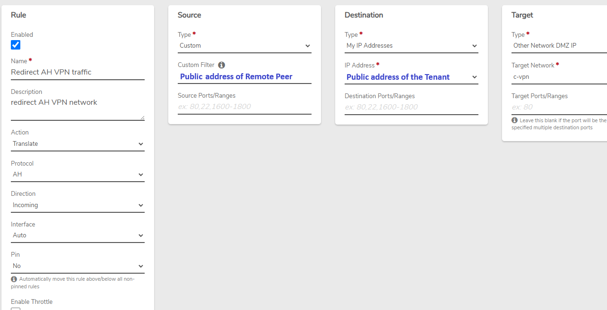

# IPsec Example - Tenant/NAT UI Address

The following example configures an IPsec peer within a VergeOS tenant. In this example, the dedicated IP address used for accessing the tenant UI is also used for the IPsec tunnel, with NAT rules in place to direct tunnel traffic appropriately.


**This example pertains to a tenant using a dedicated IP address; tenants using a shared address (via proxy/PAT rules) will require different configuration.**



**IPsec is a complex framework that supports a vast array of configuration combinations with many ways to achieve the same goal, making it impossible to provide one-size-fits-all instructions.  Sample configurations are given for reference and should be tailored to meet the particular environment and requirements.**



**Consult the [IPsec Product Guide Page](https://docs.verge.io/product-guide/vpn/ipsec/) for step-by-step general instructions on creating an IPsec tunnel.**


## Host Configuration
Assigning the UI address to a tenant automatically creates rules on the host system (external and tenant networks) to channel traffic appropriately. No further configuration should be needed on the host.


****All configuration outlined below is done within the tenant system.****


## VPN Network Configuration

## Phase 1

## Phase 2

## Default VPN Network Rules

**Default Firewall Rules** -
The following necessary firewall rules are **created automatically** when a VPN network is created:

* **Allow IKE**: Accept incoming UDP traffic on port 500 to **My Router IP**
* **Allow IPsec NAT-Traversal**: Accept incoming UDP traffic on port 4500 to **My Router IP**
* **Allow ESP**: Accept incoming ESP protocol traffic to **My Router IP**
* **Allow AH**: Accept incoming AH protocol traffic to **My Router IP**


**These rules can be modified to restrict to specific source addresses, where appropriate.**


## Additional VPN Network Rules

Additional rules need to be created on our new VPN network:

**VPN NAT Rule:**


**The incoming NAT rule must be moved to the top, before the *Accept* Rules. Instructions for changing the order of rules can be found in the Product Guide: [Network Rules - Change the Order of Rules](https://docs.verge.io/product-guide/networks/network-rules/#change-the-order-of-rules)**


**Default Route Rule:**

**VPN SNAT Rule:**

## External Network Rules

Translate rules are necessary on the tenant's external network, to send IPsec traffic to the VPN network:

**External UDP NAT Rule:**

**External ESP NAT Rule:**

**External AH NAT Rule:**

## Connecting Internal Networks to the VPN

Routing can be configured between the VPN network and other internal networks to provide tunnel access to those networks; see [How to Configure Routing Between Networks](routing-between-internal-vergeio-networks.md).


**New rules must be applied on each network to put them into effect.**

