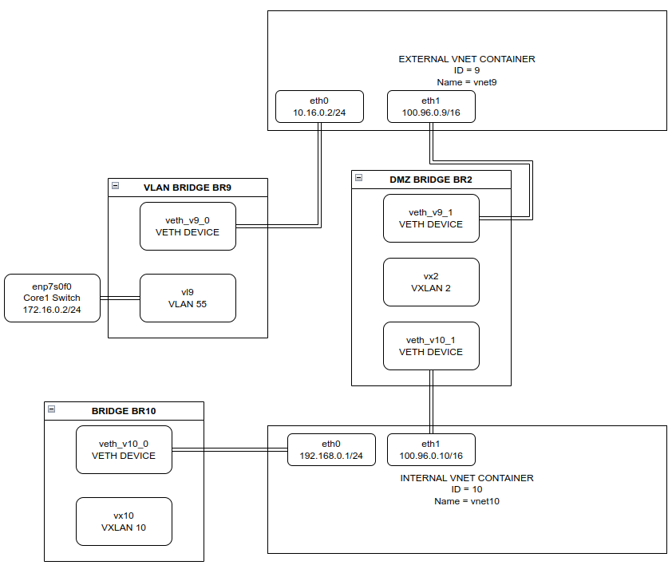
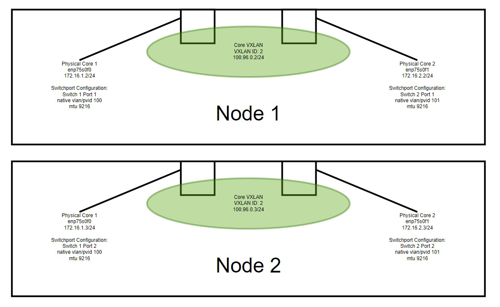

# Understanding Traffic Flow

## Traffic/Network Flow Diagram
.png)

 

## Example of an External Network using VLAN 55 and an Internal Network

 

## Example of the Core Network Configuration

 

---


**Document Information**

- Last Updated: 2024-03-21
- vergeOS Version: 4.12.5

