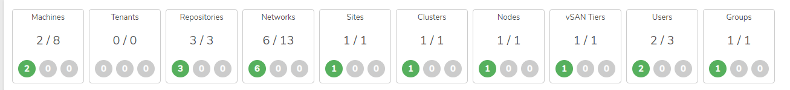

# Proper Power Sequence

## Proper Shutdown Sequence for a VergeOS Environment

To power off a cluster (a collection of two or more nodes) follow these steps:

1. Check any running workloads on each node of the cluster. Navigate to the node dashboard for each node and review the **Running Machines** section.
2. If there are tenants running on any of the nodes, log into those tenant environments and gracefully shut down all running workloads.
3. Power off all running workloads on each node, including VMs, tenant nodes, VMware backup services, and NAS services (if applicable).


**vNet Containers**

There is no need to manually stop any running vNet containers; they will be gracefully stopped automatically in the subsequent steps.


4. After stopping all running workloads, navigate to the **Cluster dashboard** for the cluster you wish to power off.
5. Select **Power Off** from the left-hand menu to begin shutting down each node in the cluster.
6. Finally, navigate to **System -> Clusters** and select **Power Off** in the left menu to power off the entire cluster.


**IMPORTANT**

If an environment contains multiple clusters, _**ALWAYS**_ shut down the cluster containing the controller nodes (Node1 & Node2) **LAST**.


---

## Proper Power On Sequence for a VergeOS Environment

To properly power on a VergeOS environment, perform the following steps:

1. Power on **Node1**.
1. Once **Node1** is online, power on **Node2**.
1. Power on all other nodes, waiting approximately 1 minute between power actions.
1. On the main dashboard, verify that the environment is **Green** and **Online**.

---


**Document Information**

- Last Updated: 2024-08-29
- vergeOS Version: 4.12.6

