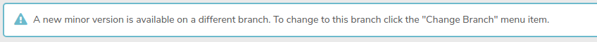
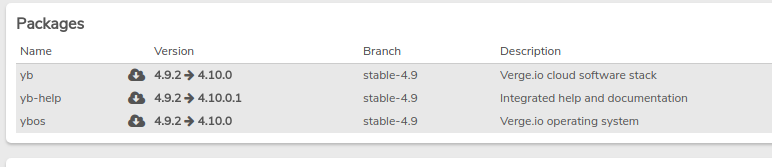
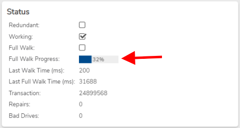

# How to Update Your VergeOS Environment


**WARNING: DO NOT SKIP MAJOR VERSIONS**

For example, if you are on version 4.8, please update to version 4.9 before updating to 4.10. **Skipping versions could cause major database and configuration issues.**


The VergeOS platform supports 'zero downtime' updating. This means that during a routine update process, guest workloads (VMs and tenant environments) can remain on and running as normal.

> For more information on the update process, please refer to our [Product Guide](https://docs.verge.io/product-guide/system/licensing-and-updates/).

The time required to complete an update varies depending on factors such as:
- Number of nodes in the system
- Storage consumed on the vSAN
- Data change rate generated by workloads during the update
- Hardware performance (processor speed, disk type, network speed)


**During the update, you may see tiers and drives alternate between **Online**, **Verifying**, or **Repairing** statuses. This is normal as the system verifies data integrity.**



**Before performing an update, verify that your system memory usage is within limits. For example, in a two-node configuration, total system memory should be under 50% utilization to allow the remaining node to handle 100% of workloads.**



**Ensure no nodes are in Maintenance mode before proceeding with the update.**


## Update Procedure

1. Log in to the VergeOS UI.
2. Navigate to **System > Updates**, then select **Check for Updates** in the left menu.

    - A pop-up will prompt Yes or No, select **Yes**.
    - If a banner appears stating "A new minor version is available on a different branch," follow the prompt to change branches by selecting **Change Branch** in the left menu. Confirm with **Yes**.
   

3. The packages to be downloaded will now be highlighted.
   
    - Select **Download** in the left menu.
    - A pop-up will prompt Yes or No, select **Yes**.
    - The download process will appear on the dashboard in the **Current Update Server** tile.

4. Once the download completes, the **Install** action will become available.
    - Select **Install** when ready.
    - Confirm with **Yes** to begin the install.

5. After installation, a request to reboot the system will occur.
   - Select **Reboot** in the left menu to initiate a rolling reboot across all nodes.


**Note**

The update will start with **Node 1**, putting it into maintenance mode and migrating workloads to another node. During minor version changes, you may briefly lose access to the UI as it fails back to Node 1. This is normal and should last no more than a minute or two. Workloads should not experience network issues.


## Troubleshooting Steps

### Workloads Failing to Migrate
- This error is usually due to insufficient resources (RAM) in the cluster. Try migrating other workloads or adjust RAM usage. More causes and solutions are detailed [here](../virtual-machines/workloads-failing-to-migrate.md).

### vSAN Taking a Long Time to Verify
- The verification process depends on factors like network speed, disk type, and consumed data. HDDs will take longer than NVMe or SSDs. On VergeOS versions 4.9.0 and higher, check the **Full Walk Progress** on the tiers dashboard for an indication of how far along the verification is.

    


**WARNING**

This process must complete before rebooting any additional nodes. Failure to do so can result in a **double failure**, causing workloads to crash.


### Unable to Connect to Update Server
- Ensure the system has a working DNS server on its external (UI) network:
    1. Navigate to the external network dashboard.
    2. Select **Diagnostics** in the left menu.
    3. Set Query to **DNS Lookup** and select **Send**.
    4. If DNS is properly configured, the response will display Verge.io's IP address. If not, check DNS settings and retry the query.

- Expired Update Server credentials can also cause this issue. These are tied to the system's license and should be renewed through your VergeOS sales representative.

---


**Document Information**

- Last Updated: 2024-09-03
- VergeOS Version: 4.12.6

