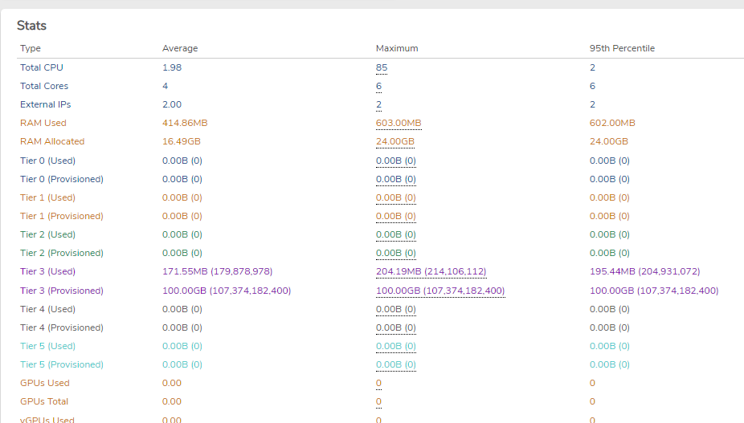

# Viewing Tenant Consumption Statistics


**This information may not pertain to your particular pricing model. Consult your sales representative for more information.**


## Tenant Consumption Statistics:

- Navigate to **Tenants** > **List**
- Locate and select your tenant, click **View**
- Click on **History** in the left menu
- Choose your month/year and click **Apply**
- Scroll down to the bottom.

**RAM Consumption**: Total RAM Allocated 95th percentile
**Storage Consumption**: Tier X (Provisioned) - add up all tiers at the 95th percentile


**For RAM, tenants consume everything that they are allocated. If the tenant is not using all the RAM that it is allocated, reduce the RAM allocated amount to lower overall consumption.**


---


**Document Information**

- Last Updated: 2024-09-03
- VergeOS Version: 4.12.6

