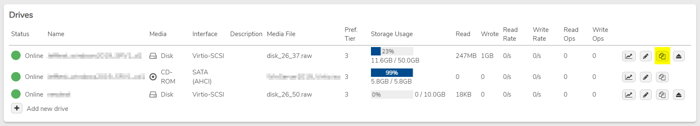

# Making a Non-Persistent VM

## How to Create a Non-Persistent VM on Reboot

A Non-Persistent VM reverts to its original state after a reboot, discarding any changes made during the session. This is useful for VDI (Virtual Desktop Infrastructure) environments where the system should reset after each use.

### Steps to Create a Non-Persistent VM:

1. Navigate to the **VM dashboard**.
2. Shutdown the VM by selecting **Actions > Power Off** or using the **Power button**:


   This ensures the data is in a good state for cloning.


3. Click the **Copy** button next to the main disk on the VM.
   
4. Change the **Media Type** to **Non-Persistent** and click **Submit** at the bottom.
5. Click the **Edit** icon  for the original **Disk Media Type**.




   The new disk will show a **Media Type** of **Non-Persistent**. Any changes made to this disk will be reverted upon a reboot of the VM.
6. Uncheck the **Enabled** checkbox.
7. Start the VM by selecting **Power On** from the left-hand menu or clicking the **Play button**:

This will boot the VM using the non-persistent disk. The disk is fully writable during the session, but all changes will be discarded upon reboot, reverting the VM back to its original state.


**Do not delete the original disk. It will not take up additional space due to **Deduplication**.**


---


**Document Information**

- Last Updated: 2024-08-29
- vergeOS Version: 4.12.6

